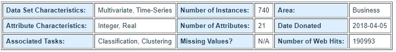

---
title: "Práctica 2: Limpieza y validación de los datos"
author: "Pablo A. Delgado"
date: '`r format(Sys.Date()-1,"%e de %B, %Y")`'
output:
  pdf_document: 
    highlight: zenburn
    toc: yes
    toc_depth: 5
    latex_engine: lualatex
  word_document: default
  html_document:
    highlight: default
    theme: cosmo
    toc: yes
    toc_depth: 5
---    

```{r setup, include=FALSE}
knitr::opts_chunk$set(echo = TRUE)
```


# Detalles de la actividad

## 1. Descripción

En esta actividad se elabora un caso práctico, consistente en el tratamiento de un conjunto de datos, orientado a aprender a identificar los datos relevantes para un proyecto analítico y usar las herramientas de integración, limpieza, validación y análisis de las mismas.

## 2. Objetivos

Los objetivos concretos de esta práctica son:

* Aprender a aplicar los conocimientos adquiridos y su capacidad de resolución de
problemas en entornos nuevos o poco conocidos dentro de contextos más amplios o
multidisciplinares.

* Saber identificar los datos relevantes y los tratamientos necesarios (integración, limpieza y validación) para llevar a cabo un proyecto analítico.

* Aprender a analizar los datos adecuadamente para abordar la información contenida en los datos.

* Identificar la mejor representación de los resultados para aportar conclusiones sobre el problema planteado en el proceso analítico.

* Actuar con los principios éticos y legales relacionados con la manipulación de datos en función del ámbito de aplicación.

* Desarrollar las habilidades de aprendizaje que les permitan continuar estudiando de un modo que tendrá que ser en gran medida autodirigido o autónomo.

* Desarrollar la capacidad de búsqueda, gestión y uso de información y recursos en el ámbito de la ciencia de datos.

## 3. Competencias

En esta práctica se desarrollan las siguientes competencias del Máster de Data Science:

● Capacidad de analizar un problema en el nivel de abstracción adecuado a cada situación y aplicar las habilidades y conocimientos adquiridos para abordarlo y resolverlo.

● Capacidad para aplicar las técnicas específicas de tratamiento de datos (integración, transformación, limpieza y validación) para su posterior análisis.


# Resolucion


## 1. Descripcion del Dataset


Dado que actualmente la demanda de las empresas para atender los diferentes objetivos que se le plantean son cada vez mas criticos y contar con todo el personal es clave para resolverlos o llevarlos a cabo, ideal seria poder preveer cualquier situacion futura que impida contar con todos los recursos y poder gestionar los proyectos y evitar riesgos de entrega, implementacion o puesta en produccion de los mismos.

Es por eso que se desea a traves del dataset disponible descripto mas abajo poder determinar o predecir el ausentismo de los recursos humanos de una compania.

Incluso, bajando mas de nivel dando una ejemplo mas concreto, si consideramos las metodologias agiles, donde de antemano se prevee la capacidad con la que contara el equipo en el proximo sprint, que mejor que tener como ayuda para un scrum master una prevision de ausencias segun reglas prestablecidas de acuerdo al comportamiento general de un miembro del equipo?

Podriamos entender por ejemplos: porque se dan las ausencias? por temas personales? segun en que estacion del año estamos? podemos segmentar estos analisis segun las caracteristicas o habitos de ciertos grupos de empleados?

Pensemoslo no solo para establecer la capacidad del equipo, imaginemos si conocer estos posibles patrones de comportamiento podrian ayudar a RRHH a mejorar la seleccion de proximos candidatos a un puesto? o mismo la contratacion de personal temporal segun la demanda estacional de proyectos dentro de una empresa y contrastandolo con la cantidad posibles de horas de aunsencia del personal actual.

Luego intentaremos buscar a partir de los datos patrones que nos permitan tener mas informacion acerca del comportamiento de los empleados que nos den mas informacion de posibles cuestiones a tener en cuenta o patrones, como dijimos, en el comportamiento a la hora de ausentarse o la relacion que hay con la cantidad de horas en las que se ausentan.

Para ello con los algoritmos de regresion, con todo lo analizado previamente buscaremos predecir el comportamiento futuro del empleado o las horas que podran llegar a ausentarse en el futuro.

Los datos que utilizaremos para esta tarea sera el obtenido de descargado del UC Irvine Machine Learning Repository:

https://archive.ics.uci.edu/ml/datasets/Absenteeism+at+work

Abstract: The database was created with records of absenteeism at work from July 2007 to July 2010 at a courier company in Brazil.



Tal como se comenta en su descripcion este dataset permite realizar tareas de clasificacion y clustering. 

* Data Set Information:
The data set allows for several new combinations of attributes and attribute exclusions, or the modification of the attribute type (categorical, integer, or real) depending on the purpose of the research.The data set (Absenteeism at work - Part I) was used in academic research at the Universidade Nove de Julho - Postgraduate Program in Informatics and Knowledge Management.

* Attribute Information:

		1. Individual identification (ID)
		2. Reason for absence (ICD). 
		3. Month of absence
		4. Day of the week 
		5. Seasons 
		6. Transportation expense
		7. Distance from Residence to Work (kilometers)
		8. Service time
		9. Age
		10. Work load Average/day
		11. Hit target
		12. Disciplinary failure
		13. Education 
		14. Son (number of children)
		15. Social drinker 
		16. Social smoker 
		17. Pet (number of pet)
		18. Weight
		19. Height
		20. Body mass index
		21. Absenteeism time in hours (target)      


> Todas los valores descriptivos o categoricos en las observaciones ya vienen convertidos a numericos en el dataset original. Aqui un detalle de los mismos:

**Reason for absence**

        1. Certain infectious and parasitic diseases
        2. II Neoplasms
        3. Diseases of the blood and blood-forming organs and certain disorders involving the immune mechanism
        4. Endocrine, nutritional and metabolic diseases
        5. Mental and behavioural disorders
        6. Diseases of the nervous system
        7. Diseases of the eye and adnexa
        8. Diseases of the ear and mastoid process
        9. Diseases of the circulatory system
        10. Diseases of the respiratory system
        11. Diseases of the digestive system
        12. Diseases of the skin and subcutaneous tissue
        13. Diseases of the musculoskeletal system and connective tissue
        14. Diseases of the genitourinary system
        15. Pregnancy, childbirth and the puerperium
        16. Certain conditions originating in the perinatal period
        17. Congenital malformations, deformations and chromosomal abnormalities
        18. Symptoms, signs and abnormal clinical and laboratory findings, not elsewhere classified
        19. Injury, poisoning and certain other consequences of external causes
        20. External causes of morbidity and mortality
        21. Factors influencing health status and contact with health services.
        And 7 categories without (CID): 
          patient follow-up (22), 
          medical consultation (23), 
          blood donation (24), 
          laboratory examination (25), 
          unjustified absence (26), 
          physiotherapy (27), 
          dental consultation (28).		  
**Day of the week**

    (Monday (2), Tuesday (3), Wednesday (4), Thursday (5), Friday (6))
**Seasons**

    (summer (1), autumn (2), winter (3), spring (4))
**education**

    (high school (1), graduate (2), postgraduate (3), master and doctor (4))
**Disciplinary failure**

    (yes=1; no=0)
**Social drinker**

    (yes=1; no=0)
**Social smoker**

    (yes=1; no=0)


Dado que el archivo es un csv y solo tiene 740 observaciones, primero haremos una rapida inspeccion manual con un notepad++. Como hemos dicho anteriormente posee todos valores numericos, tenemos encabezado de columnas y todos los valores de cada fila estan separados por punto y coma. Todos los numeros son enteros a excepcion al parecer del work load average. Mientras que por ej la estatura y el peso estan expresados en cm y kilos respectivamente.

Dicho eso comenzaremos con el tratamiento del dataset. 

******
## 2. Integración y selección de los datos de interés a analizar
******

En el caso de nuestro dataset no sera necesario realizar integracion con otros datasets ni tampoco realizar una seleccion o filtrado de los datos antes de analizarlos. Ya que todo esto fue realizado previamente por el equipo de personas que creo el proyecto en UCI.

Sin embargo realizaremos un primer analisis exploratorio de los datos (screening) para identificar si es necesario crear alguna nueva variable adicional en el dataset que nos ayude en nuestro objetivo.


Primero que nada importamos todas las librerias de R que estaremos usando o preveemos utilizar.


```{r}
packages <- c("readr", "dplyr", "ggplot2","factoextra","gridExtra",
               "fpc", "reshape2", "stats","nortest", "car", "vcd", "pls")
new <- packages[!(packages %in% installed.packages()[,"Package"])]
if(length(new)) install.packages(new)
foo=lapply(packages, require, character.only=TRUE)
```


Leemos el archivo csv delimitado por ;
```{r}
abs_df <- read_delim("Absenteeism_at_work.csv", col_names = TRUE, delim=';')
```

```{r}
# Dado que los nombres de las columnas tienes espacios, los quitamos agregando puntos:
names(abs_df)<-make.names(names(abs_df),unique = TRUE)

# Chequeamos ahora los nuevos nombres de columnas
colnames(abs_df)

# chequeamos los tipos de datos las variables y vemos el sampleo de algunos de sus valores
str(abs_df)
```

Pero antes de comenzar a sacar conclusiones sobres los datos y empezar a cruzar variables podriamos discretizar variables como:

* Age
* Distance.from.Residence.to.Work
* Body.mass.index
* Absenteeism.time.in.hours

Ya que para age ya hemos visto que tenemos bastante dispersos las edades y mejor agruparlas por los clasicos rangos de edad. Con la distancia nos paso algo similar.

Para Body mass index al ser un indice nos dice poco sin contrastarlo con algo que conozcamos asi que mejor agruparlo segun los criterios que se los suele analizar a nivel medico:

    < 18.5 Underweight
    18.5-25 Normal weight
    25-30 Overweight
    > 30  Obese

Mientras que para las horas de ausentismo podriamos tambien predefinir algunos grupos o rangos horarios de ausentismo para el analisis posterior:
    
    0 h horas
    1-3 horas
    4-8 horas
    9-16 horas
    17-40 horas 
    + 40 horas


```{r}
# Creamos Reason for Absence Desc
abs_df <- abs_df %>% mutate(Reason.for.absence.Desc = case_when
                   (Reason.for.absence == 0 ~ 'No Aplica',
                    Reason.for.absence == 1 ~ 'Infectious',
                    Reason.for.absence == 2 ~ 'Neoplasms',
                    Reason.for.absence == 3 ~ 'Immune System & Blood Issues',
                    Reason.for.absence == 4 ~ 'Metabolic diseases',
                    Reason.for.absence == 5 ~ 'Mental & Behavior disorders',
                    Reason.for.absence == 6 ~ 'nervous system diseases',
                    Reason.for.absence == 7 ~ 'eye and adnexa diseases',
                    Reason.for.absence == 8 ~ 'ear and mastoid diseases',
                    Reason.for.absence == 9 ~ 'circulatory diseases',
                    Reason.for.absence == 10 ~ 'respiratory diseases',
                    Reason.for.absence == 11 ~ 'digestive diseases',
                    Reason.for.absence == 12 ~ 'skin diseases',
                    Reason.for.absence == 13 ~ 'musculoskeletal diseases',
                    Reason.for.absence == 14 ~ 'genitourinary diseases',
                    Reason.for.absence == 15 ~ 'Pregnancy, and related',
                    Reason.for.absence == 16 ~ 'perinatal conditions',
                    Reason.for.absence == 17 ~ 'Congenital malformations',
                    Reason.for.absence == 18 ~ 'abnormal clinical findings',
                    Reason.for.absence == 19 ~ 'Injury, poisoning related',
                    Reason.for.absence == 20 ~ 'morbidity and mortality',
                    Reason.for.absence == 21 ~ 'Other Factors',
                    Reason.for.absence == 22 ~ 'patient follow-up',
                    Reason.for.absence == 23 ~ 'medical consultation',
                    Reason.for.absence == 24 ~ 'blood donation',
                    Reason.for.absence == 25 ~ 'laboratory examination',
                    Reason.for.absence == 26 ~ 'unjustified absence',
                    Reason.for.absence == 27 ~ 'physiotherapy',
                    Reason.for.absence == 28 ~ 'dental consultation'
                    )
                  )


# Creamos Seasons Desc
abs_df <- abs_df %>% mutate(Seasons.Desc = case_when
                  (Seasons == 1 ~ 'Summer',
                   Seasons == 2 ~ 'Autumn',
                   Seasons == 3 ~ 'Winter',
                   Seasons == 4 ~ 'Spring')
                  )

# Creamos Education Desc
abs_df <- abs_df %>% mutate(Education.Desc = case_when
                  (Education == 1 ~ 'HighSchool',
                   Education == 2 ~ 'Graduate',
                   Education == 3 ~ 'PostGraduate',
                   Education == 4 ~ 'Ms & Dr')
                  )

# Creamos Day of the week Desc
abs_df <- abs_df %>% mutate(Day.of.the.week.Desc = case_when (
                   Day.of.the.week == 2 ~ 'Monday',
                   Day.of.the.week == 3 ~ 'Tuesday',
                   Day.of.the.week == 4 ~ 'Wednesday',
                   Day.of.the.week == 5 ~ 'Thursday',                    
                   Day.of.the.week == 6 ~ 'Friday'
                    ))

# Creamos age range
abs_df["age_range"] <- as.factor(cut(abs_df$Age, breaks =
                                       c(0,10,20,30,40,50,60,70,100), 
                                     labels = c(1, 2, 3, 4,5,6,7,8)))
# Donde se corresponden a los siguientes rangos respectivamente:
# c("0-9", "10-19", "20-29", "30-39","40-49","50-59","60-69","70-79")


# Creamos Distance range
abs_df["distance_range"] <- as.factor(cut(abs_df$Distance.from.Residence.to.Work,
                                          breaks = c(0,10,20,30,40,100), 
                                          labels = c(1, 2, 3, 4, 5)))
# Donde se corresponden a los siguientes rangos respectivamente:
# c("10km", "20km", "30km", "40km", "+40km")


# Creamos BMI
abs_df["BMI"] <- as.factor(cut(abs_df$Body.mass.index, 
                               breaks = c(0,18.5,25,30,100), 
                               labels = c(1, 2, 3, 4)))
# Donde se corresponden a los siguientes rangos respectivamente:
# c("Underweight", "Normal", "Overweight", "Obese")

# Creamos absenteeism_range
abs_df <- abs_df %>% mutate(absenteeism_range = case_when
                   (Absenteeism.time.in.hours == 0 ~ '0 h',
                    between(Absenteeism.time.in.hours, 1, 3) ~ '1-3 h',
                    between(Absenteeism.time.in.hours, 4, 8) ~ '4-8 h',
                    between(Absenteeism.time.in.hours, 9, 16) ~  '9-16 h',
                    between(Absenteeism.time.in.hours, 17, 40) ~ '17-40 h',
                    Absenteeism.time.in.hours > 40 ~ '+ 40 h'
                   )
                )


# Mientras que variables como Disciplinary failure, Social drinker y Social
# smoker no haran falta convertirlas a descriptivas ya que es claro que 1 es Yes 
# y 0 es No. Lo mismo sucede con Day of the week, es simple determinar de que
# estamos hablando cuando vemos los valores numericos. Caso similar con month,
# todos sabemos que mes representan los valores del 1 al 12, siendo el 0 lo que
# comentamos antes, valores no informados que no afectaran al modelo, aunque
# haremos nuestros testeos mas adelante en la practica.


```

Dicho eso y luego de haber agregado los campos descriptivos y discretizado sigamos analizando el resto de las variables en la siguiente seccion de limpieza. Donde analiceremos valores vacios, valores extremos, etc..

******
## 3. Limpieza de los datos
******

Hacemos las primeros chequeos del contenido del dataset:
```{r}
# visualizamos las primeras 5 observaciones
head(abs_df,5)

# Estadisticas basicas 
summary(abs_df)

# Verificamos la estructura y contenido del conjunto de datos
str(abs_df)
```


Si bien, segun la descripcion del dataset en UCI y con la inspeccion visual no hay missing values, realicemos un chequeo rapido:

```{r}
# Estadísticas de valores vacíos
colSums(is.na(abs_df))
# y ahora los missing
colSums(abs_df=="")
```

Ahora analicemos algunas variables numerica y visualmente para entender mejor los datos:

```{r}
# Veamos los valores distintos de cada atributo
sapply(abs_df, function(x) length(unique(x)))
```


Aqui vemos que tenemos 13 meses informados de ausencia, arranquemos analizando esa variable con graficas simples.

Probemos tambien dos mas, la educacion de los empleados con la cantidad de horas de ausentimos


```{r}

a = ggplot(abs_df,aes(x=Month.of.absence,fill=Month.of.absence))+geom_bar(fill="lightblue")+theme_bw()

b = ggplot(abs_df,aes(x=Education,fill=Education))+geom_bar(fill="lightblue")+theme_bw()

c = ggplot(abs_df,aes(x=Absenteeism.time.in.hours,fill=Absenteeism.time.in.hours))+geom_bar(fill="lightblue")+theme_bw()

grid.arrange(a, b, nrow = 1, ncol = 2)

grid.arrange(c, nrow = 1)

# vemos que los datos para ese mes no informado, son pocos, solo 3 obs.
table(abs_df$Month.of.absence)

# Chequeemos esos datos:
select(filter(abs_df, Month.of.absence ==0), ID,Reason.for.absence,Day.of.the.week, Education, Absenteeism.time.in.hours)
```

En cuanto a los datos con mes no informado, luego podriamos eliminar estos registros ya que como vemos:

1 tienen razon de ausentismo en 0 y ademas la cantidad de horas informadas es cero, eso indica que son personas que nunca han faltado y por eso no hay ninguna razon de ausentismo???

2 son datos del nivel de educacion 1 que corresponde al que mayor cantidad de registros tenemos, por lo que quitar 3 filas de el no deberia representar un sesgo.

Mientras que vemos en la grafica que para la variable education predominan las de valor 1. Pero claro si bien tener las variables numericas nos permite utilizar varias funciones y aplicar algoritmos, para un analisis exploratorio inicial seria bueno tener los valores descriptivos reales para entender "mas facil" los datos.

Asi que iremos agregando variables al dataset con las descripciones de estas variables numericas. 

  (high school (1), graduate (2), postgraduate (3), master and doctor (4))
  
Antes de comenzar a agregar columnas descriptivas, chequemos el punto 1 que acabamos de comentar.
  
```{r}
# Validamos para los reason 0, si hay horas de ausencia
table(filter(abs_df, Reason.for.absence ==0)$Absenteeism.time.in.hours)

# Validamos para los que no tienen horas informadas que tengan 0 en reason
table(filter(abs_df, Absenteeism.time.in.hours == 0)$Reason.for.absence)
```

Bueno, al parecer el reason 0 se corresponde a los que no se han ausentando al trabajo, salvo solo 1 obversacion donde tiene un reason de ausencia pero no ha informado horas. Por lo no afectara a nuestros analisis estos registros.
Con esto tambien revalidamos que necesitamos tener disponibles los valores descriptivos para este tipo de analisis exploratorio que estamos haciendo ya que sino  tendriamos que ir a buscar cada vez a que descripcion corresponde cada ID de variable.

Otra forma de verificar valores extremos o fuera de rango es con boxplot.stats y en particular con la variable out que directamente nos da los valores extremos. Veamoslo

```{r}
boxplot.stats(abs_df$Month.of.absence)$out
boxplot.stats(abs_df$Reason.for.absence)$out
boxplot.stats(abs_df$Education)$out
boxplot.stats(abs_df[abs_df$Absenteeism.time.in.hours!=0,]$Absenteeism.time.in.hours)$out
```
Lo que vemos aqui por ej para education es que si bien esos valores parecen extremos, al estar fuera del IQR, en realidad se trata de pocas observaciones respecto al resto de la poblacion y terminan pareciendo valores erroneos. Pero no lo son, corresponden como sabemos a personas con un nivel de educacion superior al habitual en este grupo en particular. Por lo que no deben descartarse ni aplicar ningun tipo de transformacion.

Mientras que para las horas de ausencia sucede algo similar, siempre habra casos particulares donde personas se ausenten por razones imprevistas y seran los menos. Y es justamente una de los objetivos de este estudio. Entender no solo las posibles horas de ausencia habituales, sino las de incluso casos extraños.


******
## 4. Análisis de los datos
******

### 4.1. Analisis descriptivo

Esta vez arranquemos realizando un EDA mas exhaustivo:

```{r}

pet = ggplot(abs_df,aes(x=Pet,fill=Pet))+geom_bar(fill="lightblue")+theme_bw()
Seasons = ggplot(abs_df,aes(x=Seasons.Desc,fill=Seasons.Desc))+geom_bar(fill="lightblue")+theme_bw()

age = ggplot(abs_df,aes(x=Age,fill=Age))+geom_bar(fill="lightblue")+theme_bw()
day = ggplot(abs_df,aes(x=Day.of.the.week,fill=Day.of.the.week))+geom_bar(fill="lightblue")+theme_bw()

disciplinary = ggplot(abs_df,aes(x=Disciplinary.failure,fill=Disciplinary.failure))+geom_bar(fill="lightblue")+theme_bw()
distance = ggplot(abs_df,aes(x=Distance.from.Residence.to.Work,fill=Distance.from.Residence.to.Work))+geom_bar(fill="lightblue")+theme_bw()

drinker = ggplot(abs_df,aes(x=Social.drinker,fill=Social.drinker))+geom_bar(fill="lightblue")+theme_bw()
smoker = ggplot(abs_df,aes(x=Social.smoker,fill=Social.smoker))+geom_bar(fill="lightblue")+theme_bw()


weight = ggplot(abs_df,aes(x=Weight,fill=Weight))+geom_bar(fill="lightblue")+theme_bw()
mass = ggplot(abs_df,aes(x=Body.mass.index,fill=Body.mass.index))+geom_bar(fill="lightblue")+theme_bw()

grid.arrange(pet,Seasons, age, day, disciplinary, distance, drinker, smoker, weight, mass, nrow = 5, ncol = 2)

#library(forcats)
reason = ggplot(abs_df) +
    geom_bar(aes(x = forcats::fct_infreq(Reason.for.absence.Desc)
                 #,fill="Education"
                 ), fill="lightblue")+theme_bw()+theme(axis.text.x=element_text(size=8,angle=90))

grid.arrange(reason, nrow = 1)


absenteeism = ggplot(abs_df)+geom_bar(aes(x=forcats::fct_infreq(as.factor(Absenteeism.time.in.hours) )),fill="lightblue")+theme_bw()

grid.arrange(absenteeism, nrow = 1)

```

Vemos ahora como quedaron distribuidos los datos de estas variables post discretizacion


```{r}

# Comparacion age y age discretizada
ant = ggplot(abs_df,aes(x=Age,fill=Age))+geom_bar(fill="lightblue")+xlab("Age Before")+theme_bw()
desp = ggplot(abs_df,aes(x=age_range,fill=age_range))+geom_bar(fill="lightblue")+xlab("Age After")+theme_bw()
grid.arrange(ant,desp, nrow = 1, ncol = 2)

# Distancia y Distancia discretizada
ant = ggplot(abs_df,aes(x=Distance.from.Residence.to.Work,fill=Distance.from.Residence.to.Work))+geom_bar(fill="lightblue")+xlab("Distance Before")+theme_bw()
desp = ggplot(abs_df,aes(x=distance_range,fill=distance_range))+geom_bar(fill="lightblue")+xlab("Distance After")+theme_bw()
grid.arrange(ant,desp, nrow = 1, ncol = 2)

# BMI y BMI discretizada
ant = ggplot(abs_df,aes(x=Body.mass.index,fill=Body.mass.index))+geom_bar(fill="lightblue")+xlab("BMI Before")+theme_bw()
desp = ggplot(abs_df,aes(x=BMI,fill=BMI))+geom_bar(fill="lightblue")+xlab("BMI After")+theme_bw()
grid.arrange(ant,desp, nrow = 1, ncol = 2)


# Horas de Ausentimos discretizada
ant = ggplot(abs_df)+geom_bar(aes(x=forcats::fct_infreq(as.factor(Absenteeism.time.in.hours) )),fill="lightblue")+xlab("Absenteeism Before")+theme_bw()

desp = ggplot(abs_df)+geom_bar(aes(x=forcats::fct_infreq(as.factor(absenteeism_range) )),fill="lightblue")+xlab("Absenteeism After")+theme_bw() 
 
grid.arrange(ant,desp, nrow = 1, ncol = 2)
```

Comencemos ahora a contrastar variables, encontrar correlaciones, etc.. en definitiva entender aun mejor los datos.


* Education y Ausentismo
```{r}
# Segun el nivel educativo no cambia mucho el % de horas de ausentismo es parejo en todos los niveles, el mayor porcentaje ronda entre unas horas y un dia entero. No mucho mas que eso.
ggplot(abs_df,aes(x=Education.Desc,fill=absenteeism_range))+geom_bar(position="fill")+xlab("Absenteeism Absoluto")

# Pero ahora, si es muy evidente que la mayor cantidad de personas que se ausentan son las que alcanzaron solo el High School, en el resto de los niveles el ausentismo se reduce notablemente.
ggplot(abs_df,aes(x=absenteeism_range,fill=Education.Desc))+geom_bar(position="fill")+xlab("Absenteeism Fill")

```

Esto no implica que la gente con menor educacion falte mucho o no, pero al menos en los datos que tenemos es un punto a considerar y tenerlo presente. Pero si quizas tenga que ver con la edad tal vez? veamos...


* Age y Ausentismo
```{r}
#Ahora analicemos la edad, el ausentismo y como dijimos antess combinemoslo con la educacion, en particular para los de high school.

# En general en "porcentaje" se ausentan mas veces los de 20 años, pero si vemos a que medida que aumenta la edad, aumenta tambien la cantidad de horas que se ausentan los empleados, se ve esa minima tendencia aqui:
ggplot(abs_df,aes(x=age_range,fill=absenteeism_range))+geom_bar(position="fill")

#Y por lo que terminamos viendo aqui, los que mas se ausentan en realidad son los del rango de los 30 años.
ggplot(abs_df,aes(x=absenteeism_range,fill=age_range))+geom_bar(position="fill")

# Y con este ultima grafica pareciera que los mas faltan son los que llegaron hasta el high school, y son mayores de 30 años.
ggplot(abs_df,aes(x=absenteeism_range,fill=Education.Desc))+geom_bar(position="fill")+facet_wrap(~age_range)

# pero no podemos decir lo mismo si lo vemos de esta forma, ya que en porcentajes tanto graduados como tambien postgraduados tienen altos porcentajes de ausentismo incluso en el rango de los 20 años.
ggplot(abs_df,aes(x=absenteeism_range,fill=age_range))+geom_bar(position="fill")+facet_wrap(~Education.Desc)
```

* Smokers & Drinkers

```{r}
# Con estas dos comparaciones podemos ver que el fumador tiene menos peso que el bebedor, ya que un fumador puede fumar o no, podemos decir que hay un 50 y 50. Pero es claro viendolo desde el punto de vista de los bebedores sociales: hay muy pocos fumadores, sea cual sea su condicion. Eso es bueno mas alla del dataset, un vicio menos!

smoker = ggplot(abs_df,aes(x=as.factor(Social.smoker),fill=as.factor(Social.drinker)))+geom_bar(position="fill")+facet_wrap(~absenteeism_range)
drinker = ggplot(abs_df,aes(x=as.factor(Social.drinker),fill=as.factor(Social.smoker)))+geom_bar(position="fill")+facet_wrap(~absenteeism_range)

smoker
drinker

# Digamos que tienen mas tendencia a faltar los bebedores sociales y no asi los fumadores.

```


Pero que pasa ahora con el indice de masa corporal y la distancia al trabajo?

* BMI y Ausentismo

```{r}
# en valores absolutos parece no haber una gran diferencia entre las personas de peso normal vs los empleados con sobrepeso u obesos
abs = ggplot(abs_df,aes(x=absenteeism_range,fill=BMI))+geom_bar()+theme(axis.text.x=element_text(size=8,angle=90))+xlab("Valores Absolutos")

# Pero si lo vemos en porcentajes, parece que en general los empleados con peso normal faltaran mas, por lo que tener sobrepeso no es algo que afecte al presentimo.
per = ggplot(abs_df,aes(x=absenteeism_range,fill=BMI))+geom_bar(position="fill")+xlab("Porcentajes")+theme(axis.text.x=element_text(size=8,angle=90))

grid.arrange(abs,per, nrow = 1, ncol = 2)
```

* Distancia y Ausentismo

```{r}
g1 = ggplot(abs_df,aes(x=absenteeism_range,fill=(distance_range)))+geom_bar(position="fill")+xlab("Porcentajes")+theme(axis.text.x=element_text(size=8,angle=90))

g2 = ggplot(abs_df,aes(x=absenteeism_range,fill=(distance_range)))+geom_bar()+xlab("Valores Absolutos")+theme(axis.text.x=element_text(size=8,angle=90))

# Con los rangos de distancia que armamos no parece haber una gran diferencia o algo que nos indique que rango falta mas o menos, pero si hubieramos agrupado en 2 rangos entre menos de 20km vs mas de 20km, ahi veriamos claramente una diferencia. Hay una gran diferencia entre ambas rangos de distancia. Cuanto mas lejos vivan parece que hubiera una tendencia a que se ausenten mas.
grid.arrange(g1,g2, nrow = 1, ncol = 2)
```

Podriamos seguir combinando variables, e incluso comenzar a usar una variable mas que importante: Reason.for.absence, para contrastarla con las horas y todas las demas variables, pero como sabemos son muchas en nuestro dataset para hacer esto secuencialmente.

Tal vez para acotar mejor el analisis y determinar mas facil clusters u obtener reglas o patrones mas sencillos debamos acotar el nro de variables aplicando tecnicas de reduccion dimensionalidad. 

En este caso usaremos PCA, tecnica que nos permite fusionar o crear nuevos atributos a partir de los existentes. A grandes rasgos, PCA es una transformación lineal de las variables. Cada nueva variable de un registro se contruye a partir de la antiguas variables de ese mismo registro a través de una transformación lineal fija.

Veamoslo en detalle.

### 4.2 Reduccion de Dimensionalidad: PCA

Si bien a nivel macro los pasos para aplicar PCA son:

Estandarizar variables

Calcular la matriz de covarianzas MC

Generar los eigenvectores y eigenvalores a partir de la matriz MC

Ordenar los eigenvectores a partir de los eigenvalores de manera descendente y quedarnos con los TOP k eigenvectores

Contruir la matriz de projecciones MP, a partir de los eigenvectores seleccionados

Transformar el dataset original a partir de la matriz MP para obtener las nuevas dimensiones.

Nos apoyaremos en las funciones existentes en R que permiten calcular directamente las componentes principales y los principal component scores de cada observación sin tener que ir paso por paso.

Comencemos analizando la normalidad y homocesticidad de las variables:

#### 4.2.1. Normalidad y Homocedasticidad 

Tanto la normalidad como la homocedasticidad puede validar con los siguientes test:

- Test normalidad de Anderson-Darling.

- leveneTest para variables normales o fligner.test para las que no los son.


```{r}

alpha = 0.05
col.names = colnames(abs_df)
for (i in 2:21) {
  if (i == 2) cat("Variables que no siguen una distribución normal:\n")
    if ( is.integer(unlist(abs_df[,i])) | is.numeric(unlist(abs_df[,i])) ) {
      p_val = ad.test(as.vector(unlist(abs_df[,i])))$p.value
      if (p_val < alpha) {
        cat(col.names[i])
        # Format output
        if (i < 21) 
            cat(", ")
        if (i %% 3 == 0) 
            cat("\n")
      }
    }
}
```

Como vemos la mayoria no siguen una distribucion normal segun el test, pero recordemos que por el TLC, teorema del limite central, podemos asumirla dada la cantidad de observaciones que tenemos en nuestro dataset. 

Pero que pasa con la varianza? 

Validemos algunas de las variables que hemos estando analizando visualmente antes. Donde contrastaremos la cantidad de horas de ausentismo vs diferentes cantidad de horas de servicio, de hijos, de fallos disciplinarios, etc...

```{r}
leveneTest(Absenteeism.time.in.hours  ~ as.factor(abs_df$Service.time), abs_df)
leveneTest(Absenteeism.time.in.hours  ~ as.factor(abs_df$Son), abs_df)
leveneTest(Absenteeism.time.in.hours  ~ as.factor(abs_df$Disciplinary.failure), abs_df)
leveneTest(Absenteeism.time.in.hours  ~ as.factor(abs_df$Age), abs_df)
leveneTest(Absenteeism.time.in.hours  ~ as.factor(abs_df$Transportation.expense), abs_df)
```

Como vemos en algunos casos las homocedasticidad se cumple como en otros no. Por lo que podemos afirmar que no para todas las variables se cumple la homogeneidad de varianzas.

Dada esta situacion deberiamos estandarizar las variables para que tengan media cero y desviación estándar 1 antes de realizar el estudio PCA y reducir la dimensionalidad de nuestro dataset para la posterior creacion de un modelo predictivo solo con las variables relevantes o de mayor peso.

Pero este paso podemos "saltearlo" haciendo True el parametro scale de la funcion prcomp como vemos a continuacion:


```{r}
set.seed(123)

# Con esta funcion prcomp podemos estandarizar las variables y hacer que la desviacion estandar sea 1 con el parametro scale=TRUE
pca <- prcomp(abs_df[,2:20], scale = TRUE)
names(pca)

# Donde la variable center contiene la media de cada variable antes de estandarizar
sort(pca$center, decreasing =TRUE)


# Mientras que rotation contiene el valor de los loadings ϕ para cada componente (eigenvector). El número de componentes principales se corresponde con el mínimo(n-1,p), que en este caso es  min(740,19)=19
pca_rot = pca$rotation

# veamos algunas registros:
head(pca_rot,5)

# Ahora si las varianzas estan mas igualadas post estandarizacion:
apply(X = pca_rot, MARGIN = 2, FUN = var)


```

Entender el vector de loadings que forma cada componente nos puede ayudar a interpretar que clase de información capta cada componente, por ejemplo si miramos la componente 1:

```{r}
# lo que vemos es que la primer componente capta mas informacion de la variable Education, cantidad de mascotas y gastos de viaje positivamente y negativamente del BMI, Weight y Service Time.
sort(pca_rot[,'PC1'], decreasing =TRUE)
# y asi podriamos seguir analizando el resto de las componentes para entender que variables tienen mas pesos sobre otras.


# Otra de las variables que genera la funcion prcomp es la matriz x, la cual es el resultado de multiplicar los datos por los loadings
head(pca$x)

# 740 valores x 19 componentes
dim(pca$x)
```


Veamos como se ven en un grafico de dos dimesiones al menos las primeras dos componentes:

```{r}
biplot(x = pca, scale = 0, cex = 0.5, col = c("lightblue", "blue"))

#fviz_pca_var(pca,col.var='blue')
```


Ya obtenidas las componentes principales, se puede saber cual es la varianza explicada por cada una de ellas, la proporción respecto a la varianza total y la proporción acumulada de la varianza.


```{r}

# Proporcion de la varianza explicada
fviz_eig(pca,addlabels=T)

# Proporcion acumulada de la varianza explicada
proporcion_varianza <- pca$sdev^2 / sum(pca$sdev^2)
proporcion_varianza_acum <- cumsum(proporcion_varianza)
proporcion_varianza_acum
ggplot(data = data.frame(proporcion_varianza_acum, pc = 1:19),
       aes(x = pc, y = proporcion_varianza_acum, group = 1)) +
  geom_point() +
  geom_line() +
  theme_bw() +
  labs(x = "Componentes principales",
       y = "Proporcion acumulada de la varianza explicada ")

```


**Dicho todo esto, si quisieramos por ejemplo explicar al menos un minimo de 70% de la varianza deberiamos usar las primeras 8 componentes principales.** o 10 si quisieramos explicar el 80%. El objetivo siempre es buscar aquellas componentes que explican la maxima varianza, esto es porque, queremos retener la mayor cantidad de informacion posible usando estas componentes. Entonces, cuanto mayor es la varianza explicada, mayor sera la informacion contenida en estas componentes.

Veamos o determinemos para proximos analisis cuales son las variables mas relevantes en las primeras dos componentes, ya que cuando contamos con muchas variables, podríamos decidir mostrar solo aquellas con mayor contribución.

```{r}
# Calidad de presentación de variables en un correlograma.
fviz_cos2(pca,choice='var',axes=1:2)


# Contribución de las variables a los respectivos componentes principales
fviz_contrib(pca,choice='var',axes=1, top = 10) #componente 1
fviz_contrib(pca,choice='var',axes=2, top = 10) #componente 2
```


La línea roja discontinua indica el valor medio de contribución. Para una determinada componente, una variable con una contribución mayor a este límite puede considerarse importante a la hora de contribuir a esta componente. En las representaciones anteriores, la variable Body.Mass.Index es la que más contribuye a la PC1.


### 4.3. Pruebas Estadisticas

#### 4.3.1. Contraste de Hipotesis

Anteriormente en los analisis visuales que hemos hecho vimos que el personal con diferentes niveles de educacion parecian tener diferencia en horas de ausentismo e incluso encontrabamos mas horas de ausentismos segun la edad del empleado y lo mismo sucedia con el indice de masa corporal.

Dicho eso realicemos algunas pruebas estadisticas, en particular contrastes de hipotesis para determinar si se puede inferir comportamientos a partir de estas variables sobre esta muestra en particular.

Por ejemplo planteemos la siguiente pregunta de investigacion:

- Las horas de ausentismo es mayor en empleados menores de 30 años?

O sea aqui queremos validar:

* Grupo 1: Empleados menores de 30 años
* Grupo 2: Empleados mayores de 30 años

Horas Ausentismo Grupo 1 > Horas Ausentismo Grupo 2

Por lo que las hipotesis nula (H0) y alternativa (H1) seran:

* H0: Horas Ausentismo Grupo 1 <= Horas Ausentismo Grupo 2
* H1: Horas Ausentismo Grupo 1 > Horas Ausentismo Grupo 2

entonces segun lo que comprobemos a continuacion podremos llegar a decir:

* Rechazo la H0 a favor de la H1 y por tanto si que hay evidencias que demuestran que los menores de 30 se ausentan mas que los mayores de 30. Y por tanto la respuesta a la pregunta de investigacion es SI, con el 95 de confianza

o

* No hay evidencia que permita rechazar la hipotesis nula por lo que no puede afirmarse que menores de 30 años se ausenten mas que los mayores de 30 años para la muestra seleccionada.

El contraste que aplicaremos aqui para validar esto esto es un contraste de dos muestras independientes sobre la media, es parametrico porque podemos asumir normalidad de los datos ya sea por el Teorema del Limite Central. Y se tratara de un test parametrico y unilateral por la derecha.

Como se sabe la homocedasticidad y la heterocedasticidad, tiene que ver con la variabiblidad de las muestras, es decir, los menores de 30 años se pueden parecer muchos mientras que los mayores no, o viceversa. Si las varianzas entre las dos muestras son similares se podra aplicar una test, mientras que si son distintas se debe usar otra formula.

Verifiquemos la homoscedasticidad de la variable en cuestion para poder aplicar el estadistico correspondiente a nuestro test.

```{r}
grupo1 = abs_df[abs_df$Age < 30,]$Age
grupo2 = abs_df[abs_df$Age >= 30,]$Age
var.test(grupo1, grupo2, conf.level = 0.95 )
```

Como vemos aqui dado que el p-value es mucho menor que el nivel de significancia (0.05) podemos rechazar la hipotesis nula de homogeneidad de las varianzas.

Una vez que podemos asumir que las varianzas son distintas, aplicaremos el metodo correspondiente a la media de dos poblaciones independientes con varianza desconocida distinta.

```{r}
t.test(grupo1,grupo2, alternative="greater", var.equal=FALSE)
```

Siendo que el p-value es mayor que el valor de α seleccionado, existen evidencias suficientes para no rechazar H0, osea:
 
* Grupo 1: Empleados menores de 30 años
* Grupo 2: Empleados mayores de 30 años

  H0: *Horas Ausentismo Grupo 1 <= Horas Ausentismo Grupo 2*  => \textcolor{red}{ACEPTADA}
  
  H1: *Horas Ausentismo Grupo 1 > Horas Ausentismo Grupo 2*   => \textcolor{blue}{RECHAZADA}
  
Entonces dado que el p-value es mayor que alpha, se dispone de evidencia suficiente para considerar que los menores de 30 años *NO* se ausentan mas que los mayores de 30 años con una confianza del 95%.


#### 4.3.2. Correlaciones

A partir de aqui graficos de correlacion y heatmaps es posible ver como se correlacionan las variables de un dataset

```{r}
# Una de las herramientas más útiles es calcular la matriz de correlación entre las variables. Con la función qplot y la correlación de variables, calculada con la función cor, podemos visualizar de manera fácil aquellas variables más correlacionadas, que corresponden a una intensidad mayor de color.
heat <- abs_df[,2:21]
  
qplot(x=Var1, y=Var2, data=melt(cor(heat, use="p")), fill=value, geom="tile") +
   theme(axis.text.x = element_text(angle = 90)) +
   coord_fixed()
```


```{r}
# El heatmap nos permite ir un paso más allá y agrupar las variables que tienen más relación entre ellas, a partir de un algoritmo de clustering a partir de la información de la correlación
abs_matrix <- as.matrix(scale(cor(abs_df[,2:21], use="p")))
heatmap(abs_matrix, Colv=F, scale='none')
```

Mientras que este otro grafico tambien nos permite encontrar variables correlacionadas y removerlas si asi quisieramos:

```{r}
data_corr<- cor(abs_df[,2:21])
corrplot::corrplot(data_corr, order = "hclust", tl.cex = 0.6, addrect = 8)
```

Aqui nos encontramos con algo que no habiamos analizado anteriormente de manera manual, como por ej, variables como: service time, hit target, disciplinary failure, todas ellas muestran correlacion ademas de las que comentamos antes, como obvias como podian ser education, BMI, Social Drinker, Distancia, etc...


Pero veamos todo esto de manera mas programatica y analicemos especificamente por las variables mas correlacionadas con la variable dependiente que buscamos analizar (Absenteeism.time.in.hours)


```{r}
corr_matrix <- matrix(nc = 2, nr = 0)
colnames(corr_matrix) <- c("estimate", "p-value")

# Calcular el coeficiente de correlación para cada variable cuantitativa
# con respecto al campo "Absenteeism.time.in.hours"
for (i in 3:20) {
  if ( is.integer(unlist(abs_df[,i])) | 
       is.numeric(unlist(abs_df[,i]))  ) 
  {
    # utilizamos spearman ya que no todas las variables pasaron el test 
    # homocedasticidad
    spearman_test = cor.test( as.vector(unlist(abs_df[,i])),
                            as.vector(unlist(abs_df$Absenteeism.time.in.hours)),
                              method = "spearman", exact=FALSE)
    corr_coef = spearman_test$estimate
    p_val = spearman_test$p.value
    # Add row to matrix
    pair = matrix(ncol = 2, nrow = 1)
    
    pair[1][1] = corr_coef
    pair[2][1] = p_val
    corr_matrix <- rbind(corr_matrix, pair)
    rownames(corr_matrix)[nrow(corr_matrix)] <- colnames(abs_df)[i]
  }
}

```


```{r}
corr_matrix[order(corr_matrix[,1]),]
```
Aqui vemos que las mas correlacionadas positivamente son Transportation.expense, Son, Social.drinker, mientras que las negativas son Disciplinary.failure, Day.of.the.week y Seasons.

Dicho todo esto pasemos a la construccion de un modelo que nos permita predecir todo esto que fuimos analizando hasta ahora a partir de la exploracion de los datos y la inferencia estadistica.

#### 4.3.3. Regresiones

Creamos en esta seccion 3 modelos de regresion lineal utilizando:

1- Todas las variables del dataset

2- Las primeras n componentes principales que expliquen minimo un 70% de la varianza total

3- Las variables mas correlacionadas a la variable dependiente identificadas con el test de spearman.

Veamoslo a continuacion.


##### 4.3.3.1. Generacion de dataset de training y testing

Con la función sample_frac de dplyr generamos una muestra aleatoria de nuestro dataset, donde crearemos el dataset de train especificando la proporción del dataset original que queremos, y finalmente asignaremos al dataset de test el resto de las filas que no han estado seleccionadas con la función anti_join. Esta division es necesaria para la posterior validacion de nuestro modelo. Es por eso que necesitamos tener dos conjuntos, el de entrenamiento y el de prueba. 

Es por eso que arranquemos generando los dos set de datos para ese primer objetivo:

```{r}
set.seed(123)

rows <- 1:nrow(abs_df)
abs_df <- abs_df %>% mutate(rowID = rows)
                            
train <- sample_frac(abs_df[rows,], .75)
test  <-   anti_join(abs_df[rows,], train, by='rowID') 

# Datasets de entrenamiento
training_x <- train[,c(3:21)]
training_y <- train$Absenteeism.time.in.hours

# Datasets de validacion
testing_x <- test[,c(3:21)]
testing_y <- test$Absenteeism.time.in.hours
```


##### 4.3.3.2. Creacion de Modelos

Comencemos con el modelo con todas las variables
```{r}
modelo_all <- lm(Absenteeism.time.in.hours ~ ., data = training_x)

summary(modelo_all)

# MSE empleando las observaciones de entrenamiento
training_mse <- mean((modelo_all$fitted.values - training_y)^2)
training_mse

# MSE empleando observaciones de testo
predicciones <- predict(modelo_all, newdata = testing_x)
testing_mse <- mean((predicciones - testing_y)^2)
testing_mse

# Tabla con los coeficientes de determinación de cada modelo
# Donde iremos guardando todas las variables resultado para su 
# posterior analisis
resultados = data.frame("modelo_all", summary(modelo_all)$r.squared, training_mse, testing_mse)
colnames(resultados) <- c("Modelo", "R^2", "training_MSE", "testing_MSE")
```


Ahora creemos el modelo de regresion a partir de las componentes principales. En este caso utilizaremos PCR, el método Principal Components Regression PCR consiste en ajustar un modelo de regresión lineal por mínimos cuadrados empleando como predictores las componentes generadas a partir del analisis de componentes principales (PCA) anteriormente realizado. De esta forma, con un número reducido de componentes se puede explicar la mayor parte de la varianza de los datos.

Sabiamos que si queriamos explicar al menos el 70% de la varianza debiamos minimo usar 8 componentes principales como vemos aqui:

```{r}
summary(pca)$importance[, 1:10]
```

Entonces apliquemos pcr para ello. Con la función pcr() del paquete pls se evita tener que codificar cada uno de los pasos intermedios.

```{r}
modelo_pcr <- pcr(formula = Absenteeism.time.in.hours ~ ., data = training_x, scale. = TRUE, ncomp = 8)
summary(modelo_pcr)

training_mse_pcr <- mean((modelo_pcr$fitted.values - training_y)^2)
training_mse_pcr

predicciones_pcr <- predict(modelo_pcr, newdata = testing_x, ncomp = 8)
testing_mse_pcr <- mean((predicciones_pcr - testing_y)^2)
testing_mse_pcr

resultados = rbind(resultados, c("modelo_pcr", NA, training_mse_pcr, testing_mse_pcr))
```

Por ultimo usemos las 8 variables mas correlacionadas obtenidas en el paso "XXXX" para contruir el 3er modelo.

```{r}
modelo_cor <- lm(Absenteeism.time.in.hours ~
                   Disciplinary.failure+Day.of.the.week+Seasons+Age+
                   Height+Social.drinker+Son+Transportation.expense,
                 data = training_x)
summary(modelo_cor)

# MSE empleando las observaciones de entrenamiento
training_mse_cor <- mean((modelo_cor$fitted.values - training_y)^2)
training_mse_cor

# MSE empleando observaciones de testo
predicciones_cor <- predict(modelo_cor, newdata = testing_x)
testing_mse_cor <- mean((predicciones_cor - testing_y)^2)
testing_mse_cor

resultados = rbind(resultados, c("modelo_cor", summary(modelo_cor)$r.squared, training_mse_cor, testing_mse_cor))

```


******
## 5. Representacion de los Resultados

******

Representemos aqui el resultado de haber generado 3 modelos para predecir el ausentismo:

```{r}
resultados
```

Como vemos el $R^2$ es bastante malo para los 3 modelos creados. Por lo que que podemos decir que ninguno de estos modelos de regresion lineal ajustan bien a los datos que tenemos. Incluso, por mas que para cada uno de ellos el MSE sea menor para el dataset de testing, lo cual suele indicar una buena capacidad de prediccion del modelo cuando este MSE es menor al MSE del dataset de training,....el $R^2$ sigue siendo demasiado bajo.

Ni siquiera aplicando PCA logramos una gran mejora, porque si bien logramos bajar el mean squared error respecto al modelo con todas las variables. No es un disminucion muy significativa. 

Tal vez lo mejor es utilizar regresion logistica y buscar predecir la variable dependiente de manera dicotomica tal como habiamos analizado en el EDA al dicotomizar la variable. O incluso en lugar de predecir n rangos, podriamos buscar con regresion logistica predecir si el empleado se ausentara poco o se ausentara demasiado. Por ejemplo creando una variable que represente los que se ausentan menos de 16 hs o los que se ausentan mas de eso.
O incluso se podria utilizar arboles de decision para generar reglas que nos ayuden a generar modelos que ajusten mejor a los datos.


******
## 6. Resolucion del Problema

******

Si bien no hemos logrado llegar a un modelo que ajuste bien a los datos, hemos podido identificar varios puntos que nos servirian para una segunda iteracion de este trabajo como ser:

- Con el EDA hemos podido exponer ciertos comportamientos de los datos que son relevantes a la hora de entender que empleados se ausentan mas o menos segun sus caracteristicas.

- Tanto con PCA como los analisis de correlacion nos permitieron identificar variables mas influyentes sobre la variable a clasificar.

- Con los contrastes de hipotesis pudimos revalidar o inferir situaciones de la poblacion que no fueron tan visibles con un simple analisis visual.


******
# Recursos 
******

  + Calvo M, Subirats L, Pérez D (2019). Introducción a la limpieza y análisis de los datos. Editorial UOC.
  + [Espacio de recursos UOC para ciencia de datos](http://datascience.recursos.uoc.edu/es/)
  + [Buscador de código R](https://rseek.org/)  
  + [Colección de cheatsheets en R](https://rstudio.com/resources/cheatsheets/)
  + [Sitio Web: Ciencia de Datos](https://www.cienciadedatos.net/)
  


